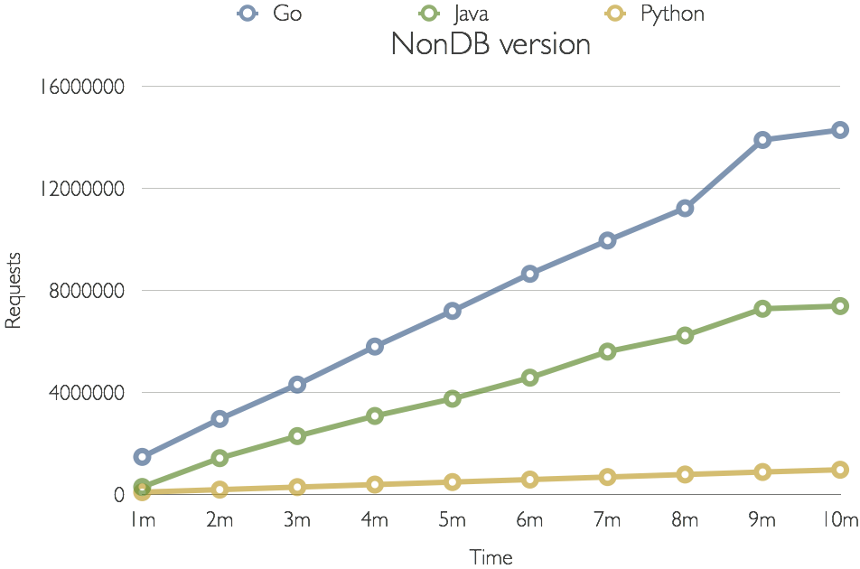

## ‘API DAYS : A comparison of REST APIs 
### GopherConAE 2016 talk
### Preet Singh

This repository contains code and slides from my GopherConAE 2016 talk. I presented a performance comparison between REST APIs in 3 tech stacks: Python + Tornado, Golang +net/http, Java+SpringBoot. When deciding between different tech stacks in your web app architecture, this comparison and code can serve as a start point to compare the performance of different tech stacks. 

#### Note : This uses Golang 1.4.2 . Ver 1.6+ has major changes. 

Golang was by far the fastest on simple requests, running twice as many requests as Java, and handled nearly fifteen times the requests handled by Python. 

#### Simple request metrics

Performance details with database requests was less clear. 

#### Database request metrics:

Java performed best, but it was clear there were multiple factors in play: SpringBoot seemed to be doing a version of connection caching, creating a much larger footprint. Golang’s connection pooling philosophy by contrast, minimizes the resource footprint, placing a limitation on the maximum number of connections in the pool, rather than allow a minimum:  

#### Connection parameters

 

* db.setMaxIdleConns : “Please don’t keep more than n connections when they’re not longer in use.”

* db.setMaxOpenConns : “Allow only max (n) connections to the db”
 
Other factors included the efficacy of the device drivers - I used MySQL as the database. Performance metrics with say, MongoDB might present an interesting comparison, since Golang’s mgo driver is allegedly far superior.

### Tech stack
Go ver. 1.4.2, only net/http
• Python 2.7.11, Tornado ver. 4.3
• Java 1.8, Spring Boot ver. 1.3.2
• Ran on my Macbook Pro 2.4 GHz i5, 8 GB RAM
• Used wrk for benchmarking

### Files + folders included
The keynote and pdf versions of my presentation, and folders for code in the 3 tech stacks. 
 
### Go REST APIs

REST APIs in Golang I've used for benchmarking: 

* V0 generates a random number, returns it as the JSON'ed response. 
* V1 retrieves ~4000 rows from a MySQL DB, sorts them, returns the JSON’ed result.  

### Python REST APIs
REST APIs in Python+Tornado that I used for benchmarking in my GopherCon DXB '16 talk. 

* Ver. 0 generates a random number and returns the JSON'ed response.
* Ver. 1 retrieves ~4000 rows from a MySQL db, sorts them, and returns the JSON'ed response.  

### Java REST APIs
* Ver. 1 : REST API in Java+SpringBoot that serves a trivial request I used for benchmarking. 
The request generates a random number, and returns it in the response as a JSON object. 
* Ver 2 : REST API in Java+SpringBoot used for benchmarking. This retrieves ~4000 Names from the City table in the world database. 
It then sorts out the names, and returns them as a JSON'ed response.  
 
